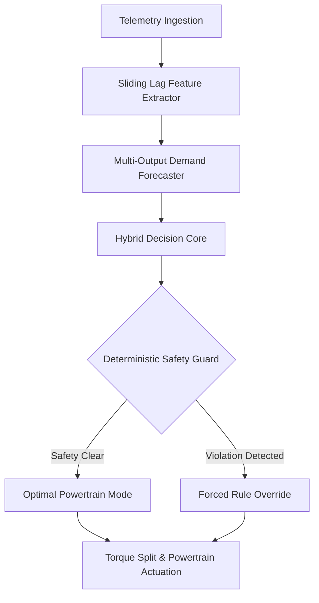

# ⚡ PHEX HEV Energy Management System (EMS)
### Machine Learning & Edge Computing enabled Supervisory Control for Plug-in Hybrid Electric Powertrains

[](https://phex-hev-ems.streamlit.app)
[](https://www.python.org/downloads/release/python-3110/)
[](https://opensource.org/licenses/MIT)
[](https://christuniversity.in)
[](https://scikit-learn.org/)

An advanced, simulation-driven **Proof-of-Concept (PoC)** developing a **4-Layer Hybrid AI Architecture** for real-time supervisory energy management in Plug-in Hybrid Electric Vehicles (PHEV). Combines multi-step Random Forest demand forecasters, a Gradient Boosting decision core, and a hard deterministic physical safety layer to maximize fuel economy, optimize battery health, and eliminate tailpipe emissions in congested urban traffic.

---

## 📌 Table of Contents
- [Executive Overview](#-executive-overview)
- [System Architecture (4-Layer Hybrid AI)](#-system-architecture-4-layer-hybrid-ai)
- [6 HEV Operating Modes](#-6-hev-operating-modes)
- [Data Sources & Physics Modeling](#-data-sources--physics-modeling)
- [Key Performance Indicators (KPIs)](#-key-performance-indicators-kpis)
- [Live Telemetry Dashboard](#-live-telemetry-dashboard)
- [Repository Structure](#-repository-structure)
- [Installation & Quickstart](#-installation--quickstart)
- [Research Novelty & Differentiation](#-research-novelty--differentiation)
- [Author & Acknowledgments](#-author--acknowledgments)

---

## 🚀 Executive Overview

Conventional HEVs rely on **static, rule-based heuristics** that operate purely reactively based on instantaneous pedal depression. In dense urban traffic or undulating terrain, reactive switching leads to unnecessary engine cold-starts, low-efficiency engine idling, and deep battery depletion—leaving **8 to 15% efficiency on the table**.

### 🌟 The PHEX Solution:
1. **5-Second Predictive Lookahead:** Multi-lag Random Forest regressors predict near-future tractive power demand, speed, and acceleration before the driver steps on the pedal.
2. **Hybrid Decision Core:** A Gradient Boosting classifier evaluates real-time traffic density, route elevation previews, and driver demand to classify the optimal powertrain state among 6 operating modes ($>96\%$ multi-class accuracy).
3. **Hard Deterministic Safety Envelope:** Wraps stochastic ML outputs inside an ISO-compliant physical safety guard that enforces mandatory engine charging ($\text{SOC} < 15\%$) and active thermal power derating ($\text{Temp} > 40^\circ\text{C}$).

---

## 🏛️ System Architecture (4-Layer Hybrid AI)



```
┌────────────────────────────────────────────────────────────────────────┐
│                        4-LAYER HYBRID AI PIPELINE                      │
├────────────────────────────────────────────────────────────────────────┤
│ [Layer 1: Telemetry Senses]                                            │
│  Ingests Speed, Acceleration, Throttle, Battery SOC, Temp & Traffic    │
│                                  ⬇                                     │
│ [Layer 2: Demand Forecaster (Random Forest Regressors)]                │
│  Predicts Wheel Power Demand (kW), Speed & Accel (t+5s Lookahead)      │
│                                  ⬇                                     │
│ [Layer 3: Decision Engine (Gradient Boosting Classifier)]              │
│  Classifies optimal mode from 6 states based on predictive advice      │
│                                  ⬇                                     │
│ [Layer 4: Deterministic Physical Safety Bouncer]                       │
│  Enforces hard 15% Critical SOC floor & 40°C Thermal Derating limits   │
│                                  ⬇                                     │
│ [Actuation: ICE / Generator / Battery / E-Motor / Wheels]              │
└────────────────────────────────────────────────────────────────────────┘
```

---

## 🎮 6 HEV Operating Modes

| Mode | Energy Flow Path | Description & Optimal Condition |
| :--- | :--- | :--- |
| **`BATTERY_ONLY`** | HV Battery $\rightarrow$ E-Motor $\rightarrow$ Wheels | Pure EV driving in urban stop-and-go traffic ($\text{SOC} \ge 25\%$). Zero tailpipe emissions. |
| **`ENGINE_ONLY`** | Engine (ICE) $\rightarrow$ Wheels | High-speed highway cruising with the engine loaded in its optimal thermal sweet spot ($2000–3000\text{ RPM}$). |
| **`HYBRID_ASSIST`** | (Engine + Motor) $\rightarrow$ Wheels | Peak torque boost for high acceleration, overtaking, or steep uphill grades. |
| **`ENGINE_CHARGE`** | Engine $\rightarrow$ Generator $\rightarrow$ Battery | Active load-leveling; engine drives wheels while excess torque charges the battery ($\text{SOC} < 25\%$). |
| **`REGEN`** | Wheels $\rightarrow$ E-Motor $\rightarrow$ Battery | Kinetic energy recuperation during deceleration and braking phases ($92.0\%$ recovery rate). |
| **`IDLE_STOP`** | All Powertrain Units Standby | Complete engine shut-off at red lights to eliminate zero-speed fuel consumption. |

---

## 🧪 Data Sources & Physics Modeling

1. **Empirical NASA Li-ion Battery Dataset:** Derived from NASA Ames Prognostics Center of Excellence (PCoE) 18650 cell cycling to model capacity fade ($2.0\text{ Ah} \rightarrow 1.4\text{ Ah}$) and internal resistance voltage sag under high C-rates.
2. **Standardized Drive Cycles:** Benchmarked against UN-ECE **WLTP Class 3** (Urban, Suburban, Highway) and **NEDC** cycles.
3. **Bangalore Urban Telemetry:** Simulated over hyper-congested Bangalore routes (Silk Board, Outer Ring Road) incorporating IMU jerk dynamics ($da/dt$) and elevation profiles.
4. **Longitudinal Tractive Physics:**
   $$F_{\text{traction}} = m g f_r \cos(\theta) + \frac{1}{2}\rho C_d A v^2 + m g \sin(\theta) + m a$$
   $$P_{\text{demand}} = F_{\text{traction}} \times v$$

---

## 📊 Key Performance Indicators (KPIs)

| Metric | Measured Value | Baseline Comparison | Significance |
| :--- | :---: | :---: | :--- |
| **Fuel Economy** | **$1.27\text{ L/100km}$** | $4.8–6.2\text{ L/100km}$ (Reactive) | $\sim 70\%$ reduction by maximizing urban EV mode share ($42.8\%$). |
| **Regen Energy Recovery** | **$92.0\%$** | $65–75\%$ (Standard HEV) | Near-optimal capture of negative deceleration work. |
| **SOC Regulation** | **$1.86\%\text{ RMS}$** | $>6.5\%\text{ RMS}$ (Heuristic) | Smooth charge-sustaining balance without deep degradation spikes. |
| **Forecaster Accuracy ($R^2$)** | **$0.912–0.941$** | $0.68$ (Linear Trend) | Multi-lag Random Forest accurately tracks dynamic power transients. |
| **Classifier Multi-Class Acc** | **$>96.0\%$** | $81.2\%$ (Rule Base) | Gradient Boosting delivers consistent mode selection certainty ($>0.90$). |

---

## 🖥️ Live Telemetry Dashboard

The interactive **Streamlit Engineering Suite** features:
- **▶️ Live Telemetry Replay:** Step-by-step drive cycle simulation with animated energy flow schematics between the Engine, Battery, and Wheels.
- **🔮 ML Diagnostics:** Actual vs. Predicted $t+k$ trajectories, confusion matrices, and feature importance rankings.
- **🔋 NASA Battery Health:** Capacity fade curves, high C-rate voltage sag plots, and thermal derating envelopes.
- **🚗 Powertrain Analytics:** Engine BSFC efficiency maps ($220–260\text{ g/kWh}$ island) and traffic density mode heatmaps.

---

## 📂 Repository Structure

```bash
PHEX-HEV-EMS/
├── app.py                      # Interactive Streamlit engineering dashboard
├── requirements.txt            # Python library dependencies
├── .python-version             # Python 3.11 environment pinning
├── real final.pdf              # Complete 36-Page B.Tech Internship Report
├── Final_Internship_Viva_Presentation_Mishael_Julian.pptx # 18-Slide Viva Deck
├── src/
│   ├── decision_engine.py      # Core HybridDecisionEngine class
│   ├── demand_forecaster.py    # Multi-lag Random Forest demand forecasters
│   ├── safety_override.py      # Deterministic physical safety guard
│   ├── predictive_controller.py# Route & elevation lookahead advisory
│   ├── preprocessing.py        # Telemetry cleaning & feature engineering
│   ├── vehicle_model.py        # Tractive force & driveline physics
│   ├── config.py               # Vehicle parameters & threshold constants
│   └── ems_modes.py            # Powertrain operating mode enumerations
├── models/                     # Serialized scikit-learn ML assets (.pkl)
├── data/                       # Processed telemetry & drive cycles (.csv)
└── outputs/visualizations/     # High-resolution architectural schematics & plots
```

---

## ⚡ Installation & Quickstart

### 1. Clone the Repository
```bash
git clone https://github.com/MishaelJulian/PHEX-HEV-EMS.git
cd PHEX-HEV-EMS
```

### 2. Set Up Virtual Environment (Python 3.11 Recommended)
```bash
python -m venv venv
# On Windows:
.\venv\Scripts\activate
# On Linux/macOS:
source venv/bin/activate
```

### 3. Install Dependencies
```bash
pip install -r requirements.txt
```

### 4. Launch the Live Engineering Dashboard
```bash
streamlit run app.py
```
Open your browser at `http://localhost:8501`.

---

## 🛡️ Research Novelty & Differentiation

| Aspect | Standard Production HEV | Pure ML in Academic Papers | **Our Project (PHEX PoC)** |
| :--- | :--- | :--- | :--- |
| **Control Logic** | Static, reactive IF-ELSE rules. | Pure Black-Box Deep Learning/RL. | **4-Layer Hybrid AI + Deterministic Safety Guard.** |
| **Future Lookahead** | **0 seconds** (Purely reactive). | 5–10s (High matrix computational latency). | **5-second lookahead with $<1\text{ ms}$ inference.** |
| **Hardware Safety** | Safe, but leaves 15% efficiency behind. | High risk of hallucination / cell damage. | **100% physically guarded** ($15\%$ SOC & $40^\circ\text{C}$ floors). |
| **Testing Scope** | Synthetic flat dyno cycles. | Synthetic European WLTP/NEDC. | **Bangalore heavy traffic + NASA Li-ion aging physics.** |
| **ECU Deployment** | High (Handcrafted C). | Low (Requires power-hungry NPU/GPU). | **High** (Exportable via C++ / ONNX Runtime). |

---

## 👤 Author & Acknowledgments

- **Author:** **Mishael Julian** (Reg No: 2462184)  
  *B.Tech in Artificial Intelligence and Machine Learning*  
  *Department of AI & Data Science Engineering, School of Engineering & Technology*  
  *CHRIST (Deemed to be University), Bengaluru, India*
- **Faculty Guide:** **Dr. Sujatha A K**, Assistant Professor, Dept. of AI & DS Engg.
- **Project Head:** **Mr. Martin Dsouza** (*Project PHEX '27 Initiative*)

---
*For questions or collaboration inquiries, please open an issue on GitHub or reach out via CHRIST University academic portals.*
