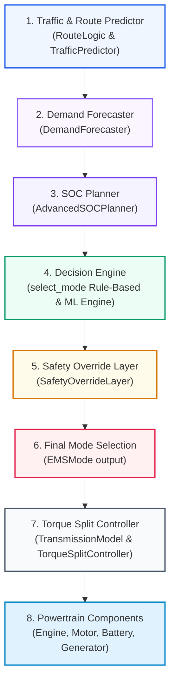
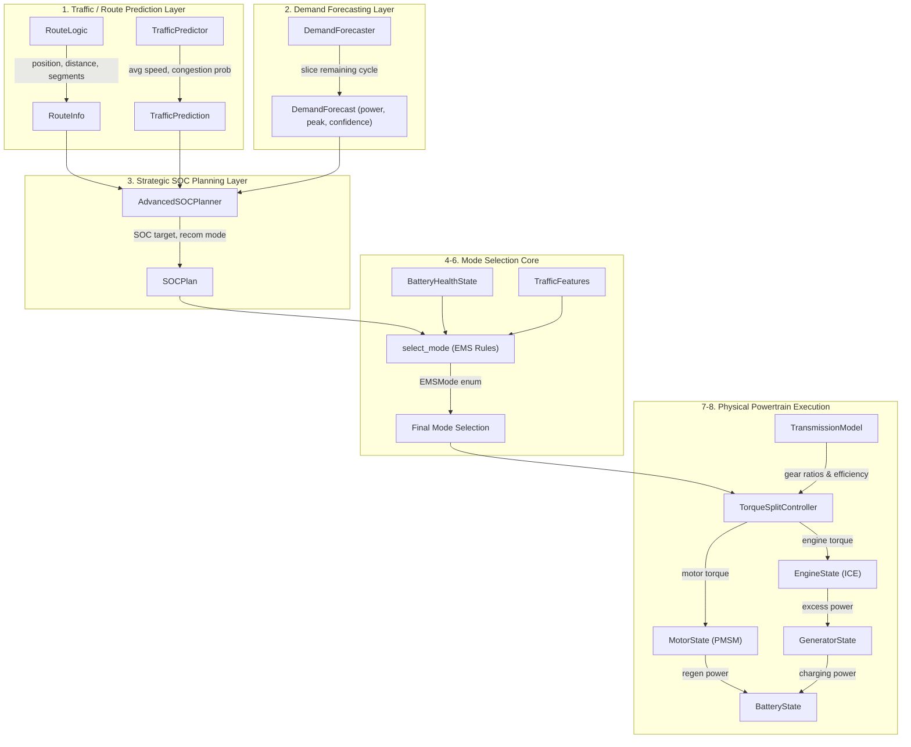

# Project PHEX — Systems Control Architecture & Data Flow

This document details the data flow and immutable control hierarchy of the Predictive Hybrid Energy Executive (PHEX) Energy Management System (EMS). 

## Immutable Control Hierarchy
The control logic flows strictly top-down to prevent lower-level component constraints from leaking into strategic planners:

## Detailed Data Flow Map

