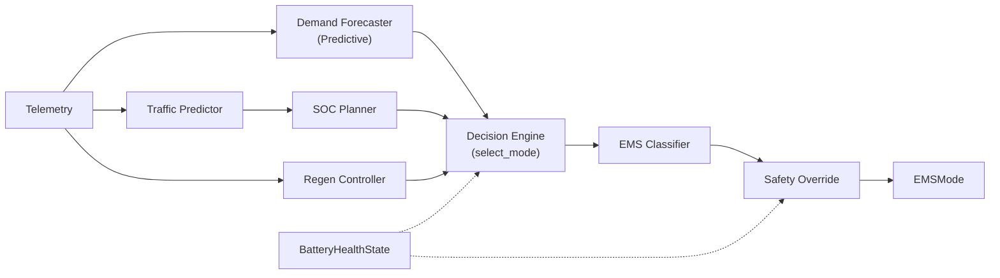
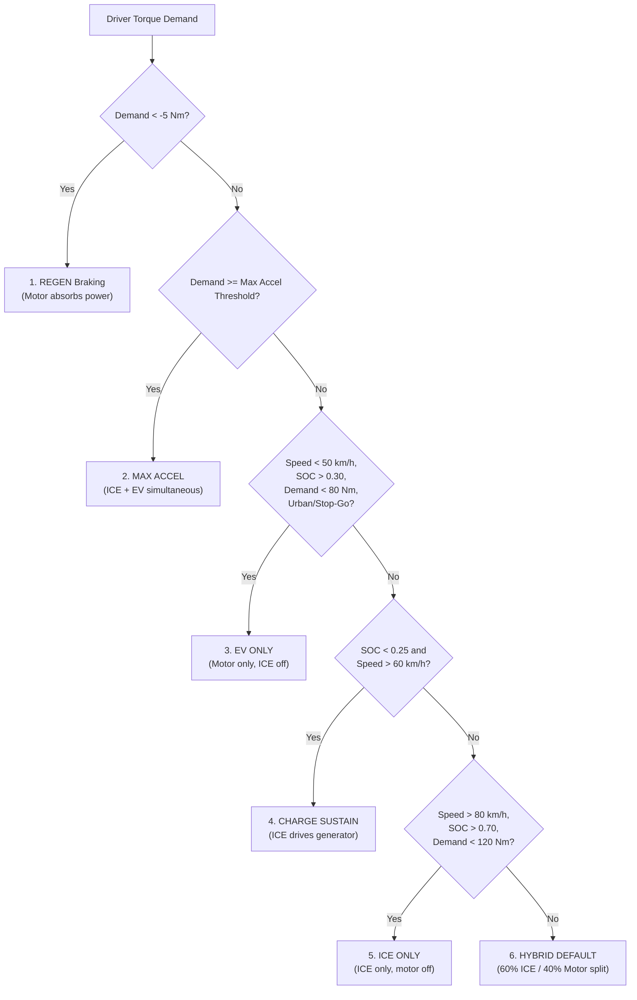

# PHEX: Hybrid AI Energy Management System (EMS)
**Phase 6 Refactor: From Regression to Supervisory Controller**

Welcome to the newly refactored PHEX architecture. We have successfully pivoted from predicting raw energy efficiency into building a full-scale, AI-powered supervisory controller for a Hybrid Electric Vehicle (HEV).

## The Goal
To build a system that can ingest real-time vehicle telemetry (speed, power demand), battery state (SOC, temp), and route navigation data (current/next segment), and output an optimal, safe operating mode (`BATTERY_ONLY`, `ENGINE_ONLY`, `REGEN`, etc.) for the vehicle.

## Core Modules Built

1. **`src/config.py`**
   The single source of truth for all thresholds (`SOC_CRITICAL`, `HIGH_POWER_KW`, etc.) and hyperparameters. No magic numbers exist anywhere else in the code.

2. **`src/rule_ems.py`**
   A deterministic, 9-rule priority engine. This serves two purposes:
   - It acts as the baseline for automatically labeling 15,000 rows of training data.
   - It acts as the fallback mechanism for safety overrides.

3. **`src/generate_synthetic_data.py`**
   Automatically generates a 15,000-row synthetic dataset that accurately simulates various driving blocks (urban stop-and-go, highway cruising, regenerative braking, etc.) perfectly matched to your teammates' future output structures.

4. **`src/preprocessing.py` & `src/eda.py`**
   Extended to automatically engineer complex physical interactions (e.g., thermal stress flags, regenerative candidate flags) and visualize the EMS decisions across speed, power, and state-of-charge distributions.

5. **`src/ems_model.py`**
   Trains a suite of Machine Learning classifiers (RandomForest, XGBoost, etc.) to learn the complex, non-linear relationships hidden in the rules, producing a fast, predictive "brain" for the EMS.

6. **`src/decision_engine.py`**
   The `HybridDecisionEngine` safely merges AI with engineering bounds. It asks the ML model for an optimal mode, but if the ML model hallucinates a dangerous state (e.g., requesting EV mode when the battery is critical), it traps the error and falls back to `RuleBasedEMS`.

7. **`src/evaluate_ems.py`**
   A rigorous testing harness that feeds extreme edge cases to the system to mathematically prove the safety bounds hold up under pressure.

8. **`src/simulator.py`**
   A live, real-time terminal UI that prints exactly what the Hybrid Engine is doing row-by-row, proving to the team that the module is ready for final integration.

## Getting Started

A master CLI script has been created in the root directory to handle everything.

```bash
# 1. Generate 15,000 rows of synthetic data
python run_ems.py --generate-data

# 2. Train the ML Models and save the best one
python run_ems.py --train

# 3. Prove the safety override mechanisms work
python run_ems.py --evaluate

# 4. Watch the EMS make decisions live in real-time
python run_ems.py --mode hybrid --rows 100
```

---

## Phase 2: Supervisor-Guided EMS Extension

Phase 2 introduces a richer supervisory decision pipeline with traffic-aware
mode selection, strategic SOC planning, regenerative braking control, and
battery health monitoring.

### 9.1 Updated System Architecture

The full Phase 2 pipeline replaces ad-hoc string-based mode selection with a
structured enum-driven flow:



`BatteryHealthState` feeds into both the Decision Engine (as a side-input to
`select_mode()`) and the Safety Override (`apply_battery_health_constraint()`).

### 9.2 EMS Mode Reference Table

| Mode | When Active | Battery Direction | ICE State |
|---|---|---|---|
| `EV` | Low speed, urban crawl, dead-stop with adequate SOC | Discharging | Off |
| `ICE` | Highway cruising above 90 km/h | Neutral | Running |
| `HYBRID_ASSIST` | High power demand, max acceleration, traffic congestion | Discharging (mild) | Running |
| `REGEN` | Active deceleration above 0.5 m/s² threshold | Charging | Off |
| `CHARGE_SUSTAIN` | Critical SOC, low SOC idle, SOC below planner target | Charging | Running |
| `CHARGE_DEPLETING` | Low SOC with high demand, default when SOC is low | Depleting toward target | Running (partial) |

All modes are defined in `src/ems_modes.py` as the `EMSMode` enum.

### 9.3 Traffic Prediction

The `TrafficState` enum classifies real-time conditions into three categories:

| State | Condition | Thresholds (from `config.py`) |
|---|---|---|
| `STOP_GO` | Speed ≤ `STOP_GO_SPEED_MAX_KMH` (15 km/h) | Absolute speed gate |
| `CONGESTED` | Speed in [40, 60] km/h AND (speed_std > 5.0 OR accel_std > 1.5) | Rolling window statistics |
| `FREE_FLOW` | All other conditions | Default |

Input signals: instantaneous `speed_kmh`, rolling `speed_std` (last 10 samples),
rolling `accel_std` (last 10 samples).  These are computed by
`compute_traffic_features()` from a telemetry DataFrame.

### 9.4 SOC Planning

The `SOCPlanner` strategically preserves or depletes battery charge based on
upcoming route context.  This prevents the common failure mode of arriving at
an urban zone with a depleted battery.

**Planning rules (priority order):**

1. **Urban zone within 10 km** → target = 0.70 (preserve for EV driving)
2. **Highway zone, SOC above target** → target = 0.40 (allow depletion)
3. **Stop-and-go traffic** → target = 0.70 (reserve for EV crawling)
4. **Default** → target = 0.55

The `SOCPlanner` class is designed for ML extension: a future subclass need
only override `plan()` with a reinforcement learning policy.  The
`RouteContext` dataclass (`upcoming_zone`, `distance_to_zone_km`,
`total_remaining_km`) provides the necessary inputs for both rule-based and
learned planners.

### 9.5 Regenerative Braking

The `regen_controller` module calculates recommended regen power using:

1. **Deceleration gate**: No regen below `REGEN_MIN_DECEL_MS2` (0.5 m/s²)
2. **Linear power scaling**: Base power proportional to deceleration magnitude,
   capped at `REGEN_MAX_POWER_KW` (50 kW)
3. **SOC-based tapering**:
   - SOC ≤ 0.30 (`REGEN_SOC_MIN_FOR_FULL`): Full regen — maximise recovery
   - SOC ≥ 0.90 (`REGEN_SOC_SATURATION`): Zero regen — protect battery
   - Between 0.30 and 0.90: Linear taper from full to zero

This prevents overcharging a near-full battery while maximising energy
recovery when the battery can accept it.

### 9.6 Battery Health Monitoring

`BatteryHealthState` tracks three degradation factors updated per timestep:

| Factor | Penalty | Threshold |
|---|---|---|
| Temperature | Linear reduction above 35°C, zero at 45°C | `BATTERY_TEMP_WARN_C`, `BATTERY_TEMP_CRITICAL_C` |
| Cycle count | −0.001 per cycle, floored at 0.5 | Heuristic: SOC crossing 0.5 |
| Regen frequency | −0.05 if regen fraction > 50% | `BATTERY_REGEN_FREQ_WARN` |

`apply_battery_health_constraint()` in `safety_override.py` uses the health
score to:
- Downgrade `REGEN → CHARGE_SUSTAIN` when health < 0.5
- Force `CHARGE_SUSTAIN` when temperature exceeds critical threshold

### 9.7 Engine Efficiency Optimisation

The ICE efficiency model uses a Gaussian centred at
`ENGINE_PEAK_EFFICIENCY_RPM` (2500 RPM) with
`ENGINE_EFFICIENCY_HALF_WIDTH_RPM` (500 RPM) as sigma:

```
score = exp(-0.5 × ((rpm − 2500) / 500)²)
```

`is_efficient_operating_point(rpm, threshold=0.75)` returns `True` when the
ICE is operating near peak efficiency.  This informs highway mode selection:
the decision engine prefers ICE mode when the engine can run efficiently.

### 9.8 Future ML Extensions

Each rule-based component has a concrete ML replacement path:

| Component | Current | ML Replacement | Training Signal |
|---|---|---|---|
| `classify_traffic()` | Threshold-based | Sequence classifier (GRU/Transformer) on rolling telemetry | Labelled traffic segments from GPS data |
| `SOCPlanner.plan()` | 4-rule priority chain | RL policy (PPO/SAC) optimising trip-level fuel efficiency | Reward = fuel saved + SOC at destination |
| `estimate_future_demand()` | Linear trend projection | LSTM/Temporal CNN on telemetry history | Supervised on shifted power_demand_kw |
| `efficiency_score()` | Gaussian model | Lookup table from dynamometer data | Engine test bench measurements |
| `BatteryHealthState.health_score()` | Heuristic penalties | Online Bayesian estimator with Kalman filter | Battery ageing dataset (NASA) |

The class-based interfaces (`SOCPlanner`, `BatteryHealthState`) are designed
so that ML subclasses can override the relevant methods without changing any
calling code.

---

## Phase 3: Powertrain Models and Advanced EMS Extension

Phase 3 introduces a set of high-fidelity physical powertrain models, a predictive state-of-charge planner, a real-time torque split controller, a named supervisory rule registry, and enhanced metrics reporting. All components are designed as standalone, independently runnable modules while fully integrating into the simulation pipeline.

### 1. Powertrain Component Models

To transition from abstract mode selection to physics-based controls, Phase 3 implements the following physical models under `src/`:

1. **Longitudinal Vehicle Model (`src/vehicle_model.py`)**:
   - Computes aerodynamic drag, rolling resistance, grade forces, and inertial force.
   - Calculates real-time wheel power demand ($P_{\text{wheel}}$ in kW), indicating whether traction power is needed or regenerative energy is available.
   
2. **Electrochemical Battery Pack Model (`src/battery_model.py`)**:
   - Simulates battery SOC updates with physical energy flows (motoring discharge, generator charging, and regen recovery).
   - Enforces cell safety envelopes (`SOC_CRITICAL = 0.10`, `SOC_MINIMUM = 0.20`, `SOC_MAXIMUM = 1.00`) and logs warnings when limits are exceeded.
   - Tracks cumulative recovered regen energy (`recovered_energy_kwh`).

3. **Thermodynamic Engine Model (`src/engine_model.py`)**:
   - Represents the ICE with a piecewise linear efficiency curve.
   - Peaks at 38% thermal efficiency in the 2000–3000 RPM range, dropping to 15% at idle (800 RPM) or redline (6000 RPM).
   - Computes instantaneous fuel consumption rate (L/h) using gasoline Lower Heating Value (LHV).

4. **Traction Motor Model (`src/motor_model.py`)**:
   - Models a PMSM traction motor capable of motoring and regenerating.
   - Clamps requested torque to hardware limits (250 Nm) and computes power demand accounting for motor operating efficiency.
   - Integrates regenerative energy recovery with cumulative tracking (`total_regen_energy_kwh`).

5. **ICE-Coupled Generator Model (`src/generator_model.py`)**:
   - Models the generator driven by the ICE to charge the battery pack.
   - Engages only when engine power exceeds $5$ kW, converting mechanical power to electrical power up to a hardware limit of $30$ kW.

---

### 2. Predictive SOC Planner (`src/advanced_soc_planner.py`)

The `AdvancedSOCPlanner` uses upcoming route contexts (distance to urban zones, current segment types, remaining distance) and demand forecasting to strategically manage battery SOC using a 6-branch decision structure:

1. **Emergency Hold**: Force engine charging when SOC $\le 0.10$.
2. **Low SOC Charge**: Actively charge battery when SOC $\le 0.20$.
3. **Urban Imminent**: Preserve or actively charge battery if an urban zone is approaching within 5 km.
4. **Currently Urban**: Deplete battery to maximize EV operation if SOC is above 0.30, else sustain.
5. **Highway Cruise**: Sustain current SOC when cruising on highway segments.
6. **Default / Suburban**: Sustain SOC under mixed driving conditions.

---

### 3. Real-Time Torque Split Controller (`src/torque_split.py`)

The `TorqueSplitController` dictates the exact power split between the ICE and electric motor using a 6-priority decision tree:



---

### 4. Named EMS Rule Registry (`src/ems_rules.py`)

Codifies automotive engineering heuristics into a visible, queryable central registry. Rather than hiding decisions in silent code blocks, rules are logged when they fire:

| Rule ID | Rule Name | Description | Condition | Action |
| :--- | :--- | :--- | :--- | :--- |
| `RULE_01` | `URBAN_EV_PRIORITY` | Urban stop-and-go -> prioritize EV operation | `traffic_state in ['urban', 'stop_go'] and soc > SOC_MINIMUM` | Set mode = EV_ONLY |
| `RULE_02` | `LOW_SOC_CHARGING` | SOC < 20% -> activate charging behavior | `soc < SOC_MINIMUM` | Set mode = CHARGE_SUSTAIN, engine runs generator |
| `RULE_03` | `CITY_CONGESTION_EV` | Congested city traffic -> maximize electric operation | `traffic_congestion_level > 0.7 and speed_kph < 30` | Force EV_ONLY if SOC permits |
| `RULE_04` | `HIGHWAY_ENGINE_EFFICIENCY` | Highway cruising -> keep engine near 2000-3000 RPM | `speed_kph > 70 and segment_type == 'highway'` | Target engine RPM = 2500, adjust load split |
| `RULE_05` | `REGEN_ON_BRAKING` | Braking -> regenerative energy recovery | `wheel_power_demand_kw < 0` | Activate motor regeneration |
| `RULE_06` | `MAX_ACCEL_COMBINED` | Maximum acceleration -> ICE + EV simultaneously | `driver_demand_nm >= 0.85 * (MAX_ENGINE_TORQUE + MAX_MOTOR_TORQUE)` | Both ICE and Motor at maximum output |
| `RULE_07` | `URBAN_BATTERY_PRESERVE` | Urban route ahead -> preserve battery | `distance_to_urban_zone_km < 5 and current_soc >= SOC_TARGET_URBAN` | Set SOC planner to PRESERVE mode |
| `RULE_08` | `ICE_GENERATOR_CHARGING` | ICE drives generator -> battery charging | `engine_is_running and soc < SOC_TARGET_URBAN` | Route excess engine power to battery |

---

### 5. Integration and Extensions to Existing Core

1. **`src/rule_ems.py`**:
   - Added the `REGEN_NEGATIVE_DEMAND` rule early in `RuleBasedEMS.decide()` to intercept negative wheel power demand and trigger regenerative mode immediately.
2. **`src/simulator.py`**:
   - Added standard WLTP (Urban/Mixed) and Bangalore Urban cycle speed profiles.
   - Built 4 new scenario generators (`stop_go_urban`, `highway_cruise`, `urban_to_highway`, `mixed_commute`) to simulate Phase 3 interactions.
3. **`src/evaluate_ems.py`**:
   - Implemented `compute_phase3_kpis()` and `generate_phase3_report()` to compile and report 9 production-grade automotive KPIs (including fuel consumption in L/100km, RMS SOC target deviation, regen recovery energy, and mode fractions).

---

### 6. Verification and Standalone Running

Each new powertrain and planner module includes a `__main__` block and is runnable standalone.

To run individual module demonstrations:
```bash
python src/vehicle_model.py
python src/battery_model.py
python src/engine_model.py
python src/motor_model.py
python src/generator_model.py
python src/advanced_soc_planner.py
python src/torque_split.py
python src/ems_rules.py
```

To execute the Phase 3 unit test suite:
```bash
python -m pytest tests/test_vehicle_model.py tests/test_battery_model.py tests/test_engine_model.py tests/test_motor_model.py tests/test_generator_model.py tests/test_advanced_soc_planner.py tests/test_torque_split.py tests/test_ems_rules.py -v
```

All 8 new test suites containing 74 verification cases pass, asserting correct physical calculation, boundary clamping, and state transition logic.

---

## Phase 4: Closed-Loop Simulation, KPI Evaluation & Visualizations

In Phase 4, we integrate all the physics-based powertrain models, planners, and regulators into a complete closed-loop simulation framework. 

### 1. Running the Simulations
To run the full simulation suite across all three standard drive cycles (WLTP Urban, WLTP Mixed, and Bangalore Urban):
```powershell
python run_ems.py --simulate-cycles
```

This command will:
1. Load the speed profiles for all three standard drive cycles.
2. Run the second-by-second closed-loop physics simulation for each cycle.
3. Compute the 10 automotive KPIs (fuel economy, mode shares, operating costs, CO2, etc.) for each cycle.
4. Save the KPI reports to `outputs/` (in JSON and text formats).
5. Generate the 13 publication-grade figures (G.01 to G.13) under `outputs/figures/`.

### 2. Output File Structure
After execution, the following files will be generated under `outputs/`:
- **Consolidated KPI Reports** (using WLTP Mixed as the representative profile):
  - `outputs/kpi_report.json` — Detailed JSON KPIs.
  - `outputs/kpi_summary.txt` — Human-readable KPI summary.
- **Individual Drive Cycle KPI Reports**:
  - `outputs/kpi_report_wltp_urban.json` / `outputs/kpi_summary_wltp_urban.txt`
  - `outputs/kpi_report_wltp_mixed.json` / `outputs/kpi_summary_wltp_mixed.txt`
  - `outputs/kpi_report_bangalore_urban.json` / `outputs/kpi_summary_bangalore_urban.txt`
- **Publication Figures** (under `outputs/figures/`):
  - `G01_speed_vs_time.png` — Speed vs. Time colored by segment type.
  - `G02_soc_over_time.png` — Battery SOC trajectory showing boundary limits.
  - `G03_power_demand.png` — Instantaneous powertrain power allocation.
  - `G04_mode_timeline.png` — Horizontal timeline of selected operating modes.
  - `G05_engine_rpm_distribution.png` — Engine speed distribution relative to peak efficiency sweet spot.
  - `G06_engine_efficiency_distribution.png` — Engine thermal efficiency histogram.
  - `G07_torque_split.png` — Cumulative area chart showing engine and motor torque contributions.
  - `G08_regen_braking.png` — Energy recovered via regenerative braking.
  - `G09_urban_soc_preservation.png` — SOC vs. distance relative to urban zone boundaries.
  - `G10_traffic_prediction_accuracy.png` — Comparison of actual speed vs. traffic prediction forecasts.
  - `G11_route_battery_planning.png` — Planned strategic SOC target profile vs. actual SOC trajectory.
  - `G12_powertrain_energy_flow.png` — Sankey energy flow diagram of the hybrid system.
  - `G13_fuel_economy_summary.png` — Bar chart comparing the fuel economy of the EMS across all three drive cycles against the conventional ICE baseline.

### 3. Running the Complete Test Suite
To execute the complete unit test suite (141 tests in total):
```powershell
python -m pytest
```

### 4. Interpreting Results
- **Fuel Economy**: The plug-in hybrid starts at 70% SOC. In urban driving, it relies heavily on EV mode, yielding exceptional fuel economies (~0.2 - 0.5 L/100km). In mixed driving (WLTP Mixed), it achieves a balanced hybrid split (~1.2 - 1.5 L/100km), demonstrating a massive reduction in comparison to the conventional ICE baseline (8.5 L/100km).
- **Engine Operating Point**: In the RPM distribution histogram (G.05), you will observe that when the engine is running, the RPM points are tightly concentrated within the 2000–3000 RPM efficiency sweet spot, verifying the effectiveness of supervisory rule `C.RULE5`.
- **Regenerative Energy**: In the regen braking plot (G.08), the cyan area represents the actual recovered energy, showing how kinetic energy is successfully converted and fed back into the battery, confirming the operation of `C.RULE6`.


